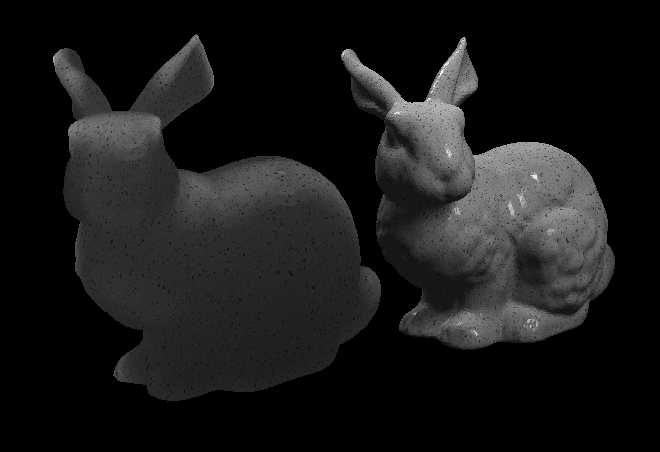

# CS248A Final Project: Real-Time Subsurface Scattering

## Author
Brian Chao | brianchc@stanford.edu 

## Introduction 
In HW3: Lighting and Materials in GLSL, we used a simple Phong reflectance model to model lighting. However, this simple model assumes that all materials are opaque and the reflected light leaves the surface exactly where it entered, as shown in the following figure:


However, many materials are translucent in real life, meaning that light can penetrate a nonzero length into the surface. These light diffuse inside of the material, and exits the surface at some point way from the initial entry point, as shown in the following figure:


This physical behaviour generates the following appearance for textures like jade, marble, or human skin:


To correctly model this behaviour, the ultimate method is to use path tracing to directly model the light paths scattering inside of the material. However, this leads to long render time and is undesirable for real-time rendering. In this final project, I will implement several real-time subsurface scattering (abbreviated as SSS in the following) algorithms that allows for real-time rendering of translucent surfaces.

## Results

### Original Shading (without SSS)


### + Wrapping


### + Screen-space SSS


### + Translucency Approximation (**Final Result**)


## Algorithms and Implementations

In the following sections, I will abbreviate subsurface scattering as "SSS". Three algorithms are combined and tuned in order to create a nice subsurface scattering look. 

1. The **wrapping** algorithm is used to model the ligth scattering behavior around edges and light borders (where L * N approaches 0). 
2. The **screen-space SSS** is used to model arbitrary scattering beneath the surfaces.
3. The **translucency approximation** is used to model light travelling from the back of the object to the front.
   
Finally, a stand-alone method to approximate subsurface scattering using spherical Gaussians is introduced.

### Wrapping
The most basic approximation of subsufrace scattering.

```glsl
// Phong shading with wrapping
vec3 Phong_BRDF(vec3 L, vec3 V, vec3 N, vec3 diffuse_color, vec3 specular_color, float specular_exponent)
{
    vec3 l = normalize(L);
    vec3 v = normalize(V);
    vec3 n = normalize(N);
    
    float wrap = 0.25;
    vec3 diffuse_component;
    diffuse_component = diffuse_color * max((dot(l, n) + wrap) / (1.0 + wrap), 0);

    return diffuse_component;
}
```

### Screen-space SSS

The core idea of subsurface scattering is that light entering a surface point of an object might leave the object at different surface points. This means light entering at a single surface point contributes to the irradiance of pixels at different locations across the surface. This essentially translates to blurring the irradiance of the pixels across the surface with a specific kernel, which is often referred to as the diffusion profile of a material.
    
Different approaches have been proposed to perform this convolution, including texture-space diffusion (paper), screen-space subsufrace scattering, and etc. (talk about why other approaches does not work well and screen space SSS is good).
   
To perform screen-space SSS, we need to perform multiple shader passes. The reason is that you can only compute the irradiance at **one fragment position** in a single pass. To accumulate irradiance values of neighboring pixels, you need to do two passes: the first pass computes the irradiance of each fragment and stores them in a texture map, and the second pass **samples multiple locations** in this texture map and accumulates the irradiance values to compute the irradiance value of a sinlge fragment. 
   
To extend the shader in HW3, we allocate a framebuffer `diffuseColorFrameBufferId_` and create texture maps `diffuseDepthTextureId_` and `diffuseColorTextureId_` that binds to this buffer. This is the buffer we will write to in our second shader pass where we compute the diffuse lighting.
```c++
diffuseColorTextureSize_ = 1024;
gl_mgr_ = GLResourceManager::instance();
diffuseColorFrameBufferId_ = gl_mgr_->createFrameBuffer();
diffuseDepthTextureId_ = gl_mgr_->createDepthTextureFromFrameBuffer(diffuseColorFrameBufferId_, diffuseColorTextureSize_);
diffuseColorTextureId_ = gl_mgr_->createColorTextureFromFrameBuffer(diffuseColorFrameBufferId_, diffuseColorTextureSize_);
if (!gl_mgr_->checkFrameBuffer(diffuseColorFrameBufferId_)) {
    exit(1);
}
checkGLError("post diffuse color framebuffer setup");
diffuseColorShader_ = new Shader(baseShaderDir + sepchar + "diffuse_color_pass.vert",
                                baseShaderDir + sepchar + "diffuse_color_pass.frag");
```
    
The first pass is the same shadow pass as in HW3, where the shadow maps are computed. The shaders that correspond to this pass are `shadow_pass.vert` and `shadow_pass.frag`.
   
The second pass evaluates the diffuse component of each fragment and stores them in a texture map. An additional diffuse component due to translucency is also included. This pass is very similar to the normal shading procedure, only that the irradiance values are written to the framebuffer `diffuseColorFrameBufferId_`, not the usual screen buffer. The shaders that correspond to this pass are `diffuse_color_pass.vert` and `diffuse_color_pass.frag`.
```c++
void Scene::renderDiffuseColorPass() {
    checkGLError("begin Scene::renderDiffuseColorPass");
    auto fb_bind = gl_mgr_->bindFrameBuffer(diffuseColorFrameBufferId_); // write to diffuseColorFrameBuffer other than screen buffer

    Matrix4x4 worldToCamera = createWorldToCameraMatrix(camera_->getPosition(), camera_->getViewPoint(), camera_->getUpDir());
    Matrix4x4 proj = createPerspectiveMatrix(camera_->getVFov(), camera_->getAspectRatio(), camera_->getNearClip(), camera_->getFarClip());  
    Matrix4x4 worldToCameraNDC = proj * worldToCamera;

    glViewport(0, 0, diffuseColorTextureSize_, diffuseColorTextureSize_);

    glClear(GL_DEPTH_BUFFER_BIT | GL_COLOR_BUFFER_BIT);
    glEnable(GL_DEPTH_TEST);
    glEnable(GL_CULL_FACE);  // hack


    for (SceneObject *obj : objects_)
        obj->drawDiffuseColor(worldToCameraNDC);

    checkGLError("end Scene::renderDiffuseColorPass");
}
```
   
The final pass samples the texture map `diffuseColorTextureId_` at multiple screen locations and accumulates the sampled irradiance values to compute the resulting diffuse irradiance at a single fragment position. 
```glsl
// inside shader_shadow.frag

vec2 uv = NDC_pos.xy / NDC_pos.w * 0.5 + 0.5; // convert NDC coordinate to [0, 1] for texture sampling

vec3 color = texture(diffuseColorTextureSampler, uv).rgb;  // sample texture color

// multiple blur passes to accumulate irradiance from nearby pixels
vec3 blur_color = vec3(color);
float steps = 10;
float theta = 0;
for(int i = 0; i < steps; i++) {
    vec2 blur_dir = vec2(cos(theta), sin(theta));
    blur_color = BlurPS(uv, blur_color, blur_dir);
    theta += PI / steps;
}
```

The blurring function in `shader_shadow.frag` is defined below:
```glsl
vec3 BlurPS(vec2 uv, vec3 color, vec2 step_)
{
    float w[6] = float[]( 0.006,   0.061,   0.242,  0.242,  0.061, 0.006 );
    float o[6] = float[](  -1.0, -0.6667, -0.3333, 0.3333, 0.6667,   1.0 );

    vec3 colorM = color;
    float depthM = NDC_pos.z;

    vec3 colorBlurred = colorM;
    colorBlurred.rgb *= 0.382;

    step_ = normalize(step_);
    vec2 finalStep = step_ * 0.05 / depthM;

    for (int i = 0; i < 6; i++) {
        // Fetch color and depth for current sample:
        vec2 offset = uv + o[i] * finalStep;
        vec3 sample_color = texture(diffuseColorTextureSampler, offset).rgb;
        colorBlurred.rgb += w[i] * sample_color;
    }

    return colorBlurred;
}

```

The blurring function performs a 1D-Gaussian blur in the specified 2D screen direction `step_`. The step value is then rescaled such that it is inversely proportional to screen depth, since with large screen depth the blurring effect should be less significant. If this depth scaling is not performed, then the same screen-space blur amount will be applied to the object independent of the object depth, which creates a blurry image when we zoom out, as demonstrated in the following figure:

||Far|Near|
|---|---|---|
|Without depth scaling|<p></p>|<p></p>|
|With depth scaling|<p></p>|<p></p>|

Finally, the specular component is also computed in this pass since subsurface scattering does not effect specular lighting.  


### Translucency Approximation

Other than scattering that happens at the surface of an object, semi-transparent objects also has non-zero transmission coefficients, meaning that light coming from the back of the object could also potentially reach the other side of the object. We use the following code to simulate this phenomenon:

```glsl
// in diffuse_color_pass.frag
float SSSDistortion = 0.4;
float SSSScale = 0.75;
float SSSPower = 2.0;
vec3  SSSLightDir = L + N * SSSDistortion;
float SSSDot = pow(clamp(dot(-SSSLightDir, V), 0.0, 1.0), SSSPower) * SSSScale;
float SSSAmbient = 0.1;
float transmittance = exp(-100*thickness);
float translucentComponent = (SSSDot + SSSAmbient) * transmittance;
float translucentColor = translucentComponent * diffuseColor;
```
The effect of each component is illustrated in the figure below:


- `SSSDistortion`: creates a non-uniformity of light direction and surface/viewing direciton dependent effect. We can see from the following figure that the illumination seems much more unuform with distortion = 0. By using a larger distortion value, we can create a view-dependent lighting effect.

|No distortion|High distortion|
|---|---|
|||

- `-SSSLightDir`: the translucent light direction. This is the translucency version of the light direction in the Phong shading model. 
- `SSSDot`: the strength of translucent component due to light sources. This is the translucent version of diffuse light intensity in the Phong shading model.
- `SSSScale`: an intensity scaling factor of the transmitted light. This is used to compensate for the small `transmittance` value due to the inverse exponential.
- `SSSPower`: The non-linearity applied to the translucent light dot product to produce highlights in the translucent component. Similar to the specular exponent in the Phong shading model.

|Low power|High power|
|---|---|
|||

- `SSSAmbient`: defines the translucent component that is always present due to environmental ambient light. This is the translucent version of the ambient light in the Phong shading model.

|No ambient|With ambient|
|---|---|
|||

- `transmittance`: defines how much the illumination from a certain direction penerates the object. This depends on the thickness of the object. The inverse relationship of the transmittance and the thickness can be linear, exponential, hyperbolic, etc, depending on the effect the user wants to create. 

To approximate the thickness of the object **as seen from the point of view of the light source**, we leverage the shadow mapping algorithm we developed in HW3. To recap, shadow mapping effectively computes the depth map of an object as viewed from the perspective from the light source. To compute the thickness of the object, we first create a virtual light source of every light source on the opposite side of the object, as shown in the following figure:


Given a light source with light direction *L* and position *V*, the light direction of the virtual light source is then *-L* and the position is *V-Lt* (move the original light source along the light direction to get the virtual light source), where *t* is chosen such that the virtual light source does not interect with the object. In this implementation we simply set *t* to be a large number. 
   
After we have created a virtual light source, we compute two depth maps (depth values normalized to 0-1) as seen from both light sources, which we refer to as the front depth map and the back depth map. The thickness of the object can therefore be represented as (up to a scaling and bias factor):
```glsl
thickness = (2 - front_depth - back_depth) * 0.5
```
Here, we normalize the depth values to 0 - 1. After we have calculated the depth, we can then characterize the transmittance of the object viewed from a certain light source direction using the thickness. In this implementation, we found that a inverse-exponential relationship between transmittance and thickness generates the best result. The transmittance map is visualized in the following figure, where the light source is at the top left behind object:


We can clearly see that the thick regions has lower transmittance (grayish regions) compared to thinner regions (white regions) like the ears or top of the head.
   
Combining all the components, we can visualize **only** the translucent diffuse component:


We can clearly see that the thinner regions have brighter diffuse color compared the the thicker regions.
   
Interestingly, if we add the the phong specular component to the translucent diffuse color, we can create a bubble/glass-like effect:


## References
- [GPU Gems Chapter 16. Real-Time Approximations to Subsurface Scattering](https://developer.nvidia.com/gpugems/gpugems/part-iii-materials/chapter-16-real-time-approximations-subsurface-scattering)
- [Real-Time Subsurface Scattering](https://observablehq.com/@devon-gadarowski/real-time-subsurface-scattering)
- [An Introduction to Real-Time Subsurface Scattering](https://therealmjp.github.io/posts/sss-intro/)
- [Efficient Screen-Space Subsurface Scattering Using Burley's Normalized Diffusion in Real-Time](https://advances.realtimerendering.com/s2018/Efficient%20screen%20space%20subsurface%20scattering%20Siggraph%202018.pdf)
- [Approximate Reflectance Profiles for Efficient Subsurface Scattering](https://graphics.pixar.com/library/ApproxBSSRDF/paper.pdf)
- [Extending the Disney BRDF to a BSDF with Integrated Subsurface Scattering](https://blog.selfshadow.com/publications/s2015-shading-course/burley/s2015_pbs_disney_bsdf_notes.pdf)
- [Physically Based Shading at Disney](https://media.disneyanimation.com/uploads/production/publication_asset/48/asset/s2012_pbs_disney_brdf_notes_v3.pdf)
- [A Practical Model for Subsurface Light Transport](https://graphics.stanford.edu/papers/bssrdf/bssrdf.pdf)


		{
			"id" : "spotlight",
		    "name" : "main_spotlight",
			"type" : "spot",
            "position" : [0, 100, 100],
			"direction" : [0, -1, -1],
            "falloff_deg" : 20.0,
            "intensity" : [7500, 7500, 7500]
		},

        {
			"id" : "spotlight",
		    "name" : "main_spotlight",
			"type" : "spot",
            "position" : [0, 100, -100],
			"direction" : [0, -1, 1],
            "falloff_deg" : 20.0,
            "intensity" : [7500, 7500, 7500]
		}