# CS248A HW3: Lighting and Materials in GLSL

## Author
- Name: Brian Chao
- Email: brianchc@stanford.edu
- SUNet ID: 06660506

## Implemented Features

All basic features are implemented.

1. Coordinate Transform
2. Phong Reflectance
3. Normal Mapping
4. Environmental Lighting

|||
|--|--|
|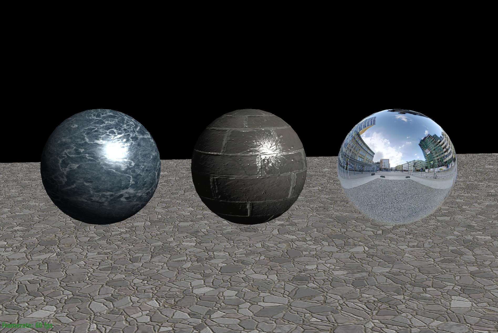|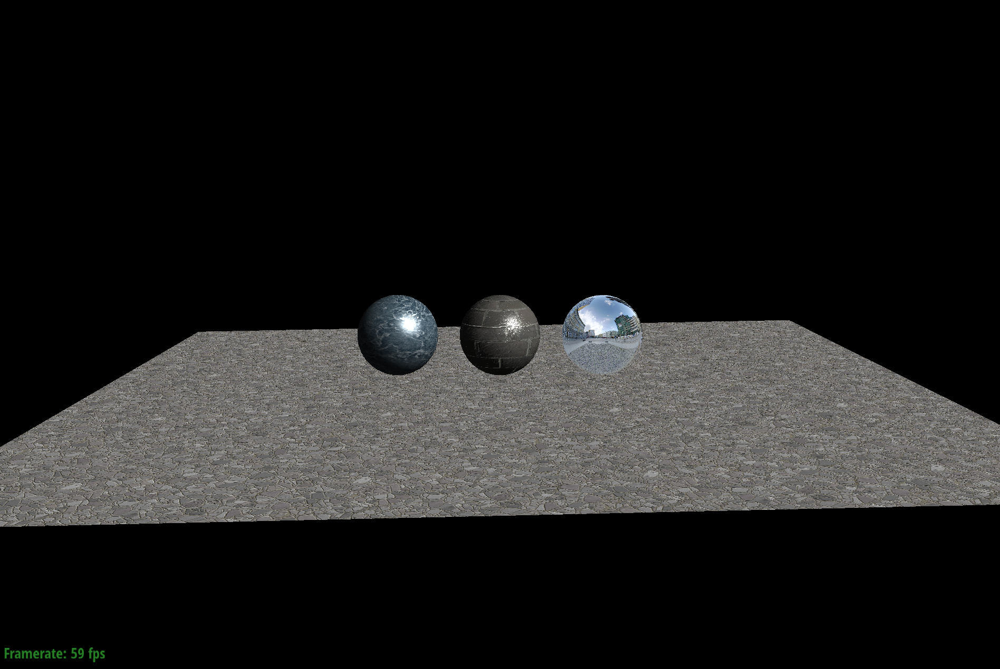|
|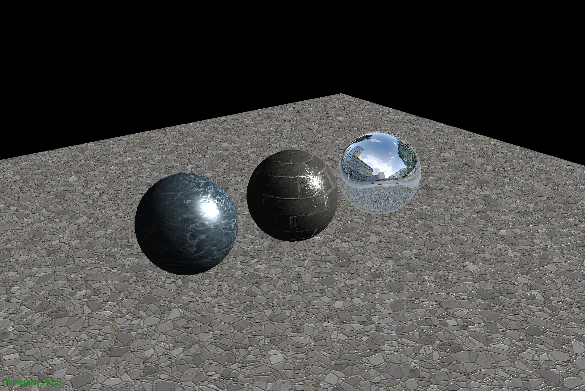||
|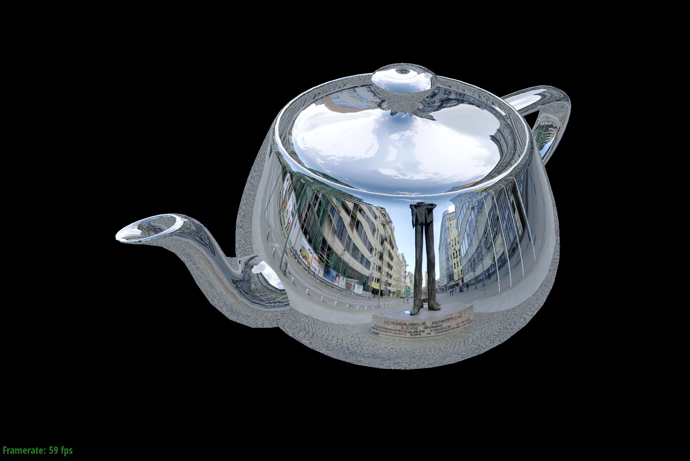|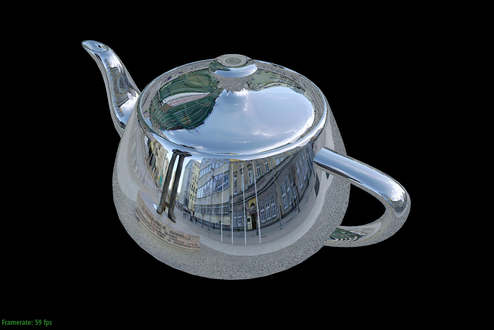|

5. Spotlights and Shadows (spotlight falloff, shadow acne removal, percentage closure filtering ...)

|||
|--|--|
|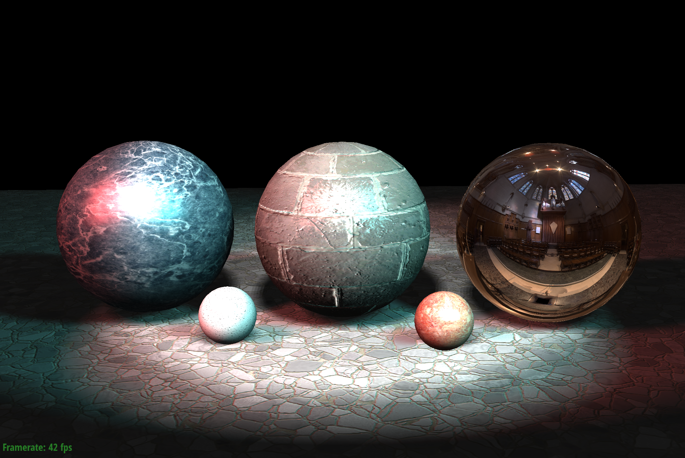|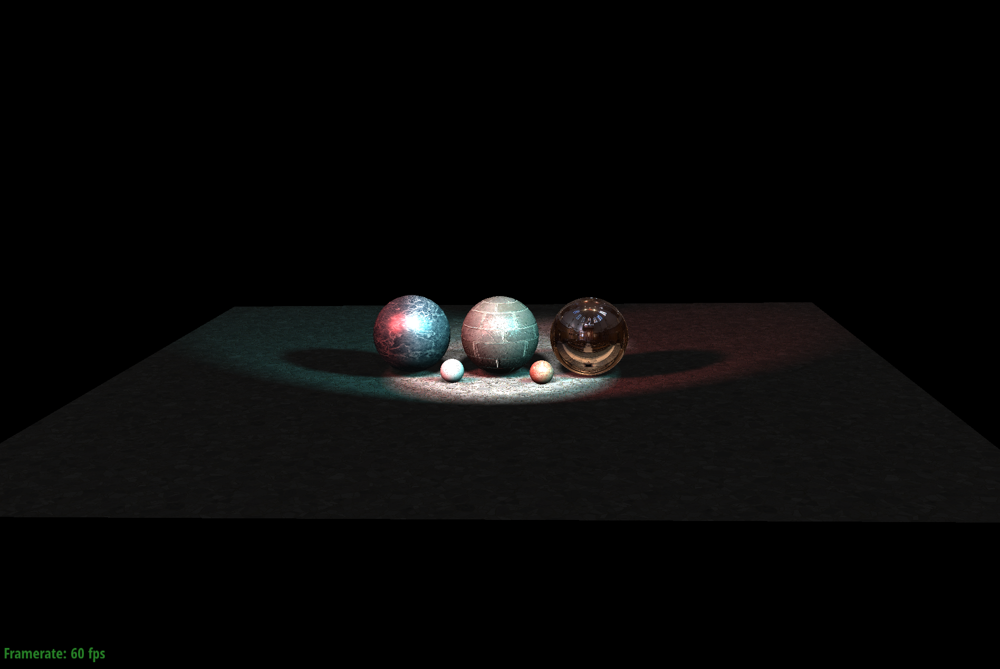|
|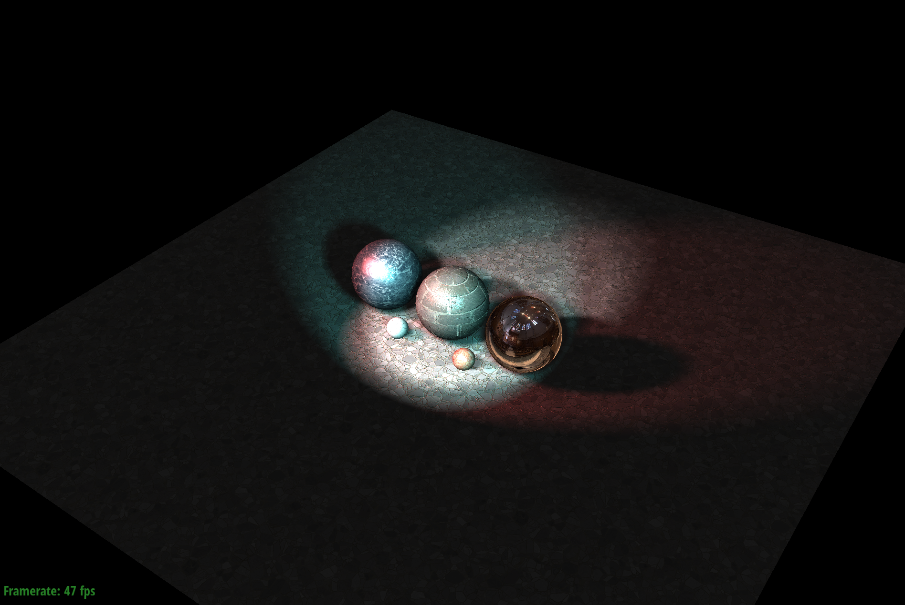|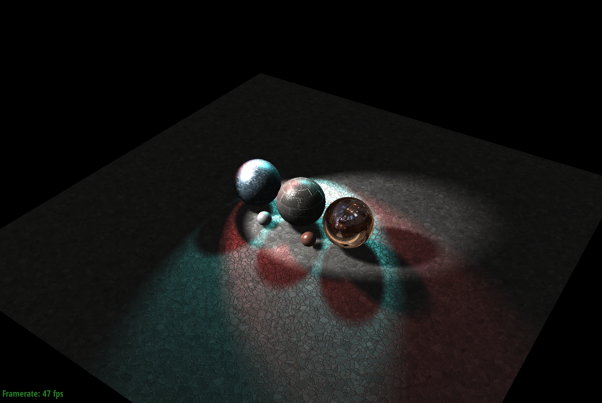|
|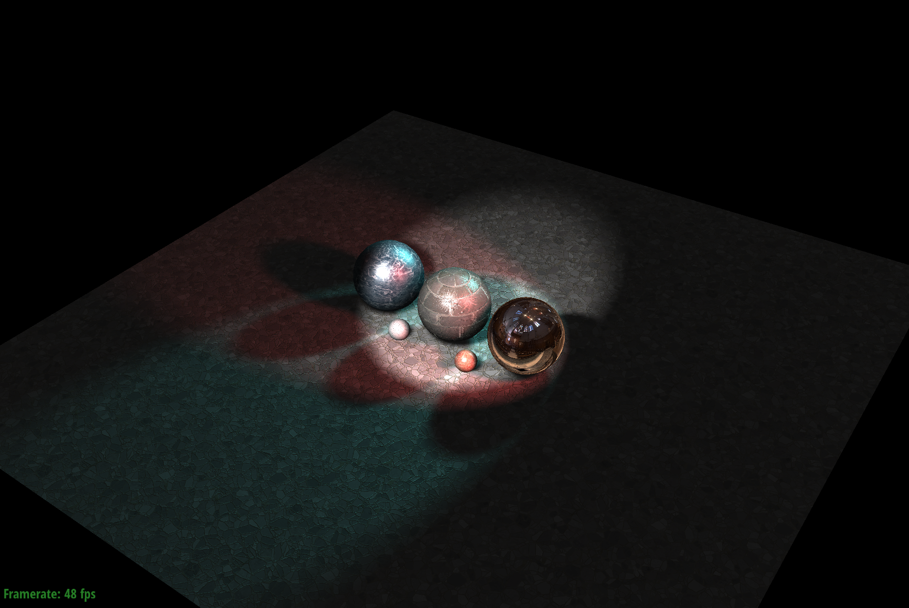|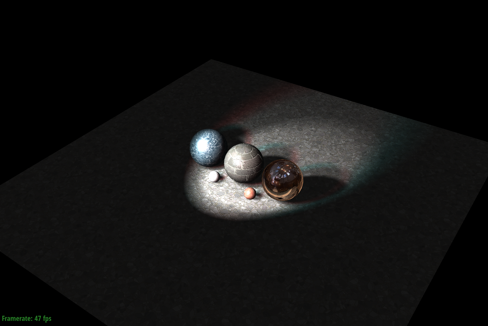|
